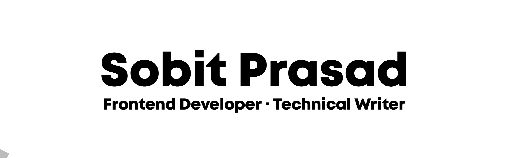
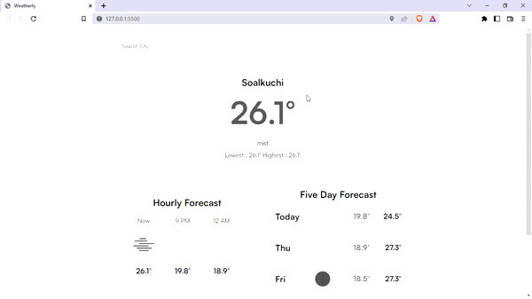
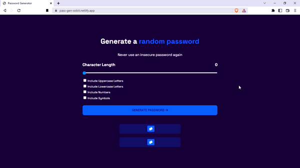
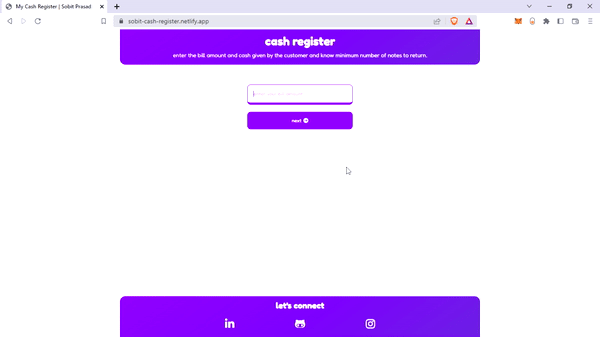
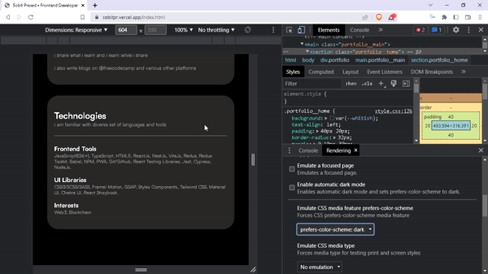

  
    
  
  

## About Me
* 👋 &nbsp;Sobit Prasad (he/him)
* ❤️ &nbsp;I'm from Bharat (India)
* 🧠 &nbsp;I’m currently JavaScript and React
* 💖 &nbsp;I love watching anime, sci-fi movies, & cooking 🍪

See [my website](https://sobitpr.vercel.app/) for more information!

## Projects
<table>
  <tr>
    <td width="50%" valign="top">
      <h3 align="center">Weatherly : A Weather App </h3>
       
      
       
      

          <a href="https://github.com/sobitp59/Weatherly">Repo</a>
           | 
          <a href="https://weatherly-sobit.vercel.app/">Live</a>
      

      
A weather app that uses <a href="https://openweathermap.org/api" target="_blank">Open Weather API</a> to fetch data. The app shows hourly as well as five day forecast.

    </td>
    <td width="50%" valign="top">
      <h3 align="center">Password Generator</h3>
       
      
       
      

          <a href="https://github.com/sobitp59/Scrimba-FDCP/tree/main/Module%204/m3-password-generator">Repo</a>
           | 
          <a href="https://pass-gen-sobit.netlify.app/">Live</a>
      

      
A simple password generator app that generate password according to you.

    </td>
  </tr>
  <tr>
  <td width="50%" valign="top">
      <h3 align="center">Cash Register</h3>
       
      
       
      

          <a href="https://github.com/sobitp59/cash-register-app-neoG-Mark10">Repo</a>
           | 
          <a href="https://sobit-cash-register.netlify.app/">Live</a>
      

      
A cash register app that shows how to return in differnt denominations.

    </td>
    <td width="50%" valign="top">
      <h3 align="center">Portfolio</h3>
       
      
       
      

          <a href="https://github.com/sobitp59/portfolio">Repo</a>
           | 
          <a href="https://sobitpr.vercel.app/">Live</a>
      

      
This is personal portfolio, where I have tried to showcase my projects and learnings.

    </td>
  </tr>
<!--   <tr>
    <td width="50%" valign="top">
      <h3 align="center">Who's That Pokémon?</h3>
       
      
       
      

          <a href="https://github.com/leifaj/whos-that-pokemon">Repo</a>
           | 
          <a href="https://leifaj.github.io/whos-that-pokemon/">Site</a>
      

      
A Pokémon guessing game! Try to guess the Pokémon based off of its silhouette.

    </td>
    <td width="50%" valign="top">
      <h3 align="center">Pixel Art Editor</h3>
       
      
       
      

          <a href="https://github.com/sobitp59/cash-register-app-neoG-Mark10">Repo</a>
           | 
          <a href="https://sobit-cash-register.netlify.app/">Live</a>
      

      
A cash register app that manages how to return in diffrent denominations.

    </td>
  </tr> -->
</table>

## Technologies

## My Stats

<!-- 

 -->
